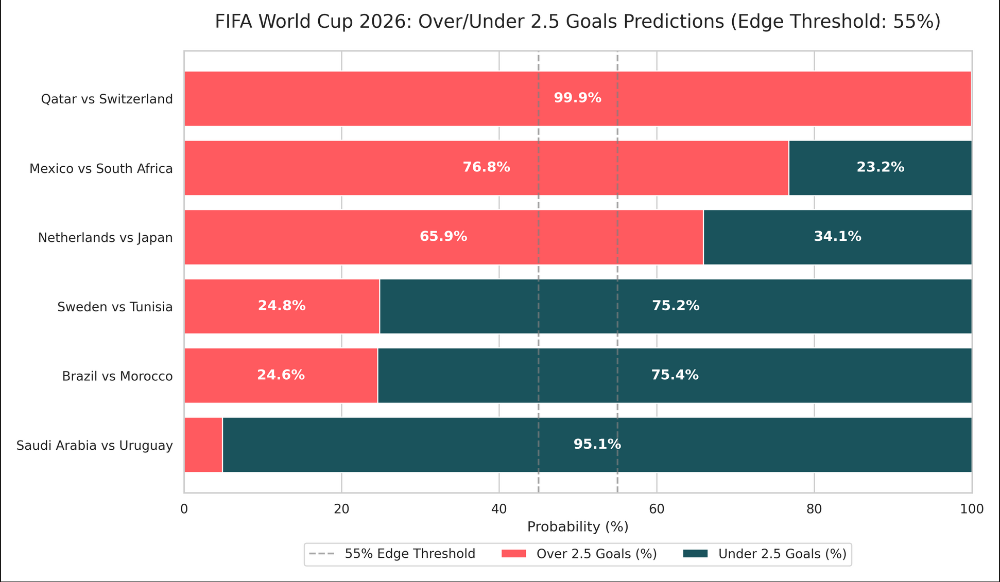

World Cup 2026 Over/Under Predictions

A deep learning project to predict whether FIFA World Cup matches will have Over or Under 2.5 goals. The model is trained on historical World Cup data from 1930-2022 and uses rolling averages of team performance to predict upcoming 2026 matches.
Data Pipeline

    The model extracts match history from a Kaggle dataset (piterfm/fifa-football-world-cup).

    It computes a 5-match rolling average of:

        Goals For (GF) and Goals Against (GA)

        Total Goals per match

        Historical Over 2.5 rate

        Win rate

    It combines home and away team statistics to generate a normalized feature vector.

Model Architecture

The core is a PyTorch Feedforward Neural Network (OverUnderNet):

    Input: 12 statistical features.

    Layers: Three fully connected linear layers (64 -> 32 -> 1) with ReLU activations.

    Regularization: Batch Normalization and Dropout layers to prevent overfitting.

    Output: A Sigmoid function predicting the probability of the match having Over 2.5 goals.

    Loss Function: Binary Cross Entropy (BCE).

Usage

The dataset is processed using Pandas and the predictions are run with PyTorch.

    Install dependencies:

    bash
    pip install pandas numpy torch scikit-learn requests kagglehub matplotlib seaborn

    Run the neuralnetoverunder.py script. The model will:

        Calculate rolling features.

        Scale the inputs.

        Run a forward pass.

        Evaluate whether there's a betting "edge" (e.g. >55% confidence).

2026 Predictions

Using data up to 2022, the model generates probabilities for upcoming 2026 matches. For example:

    Qatar vs Switzerland: High probability for Over 2.5 goals.

    Saudi Arabia vs Uruguay: High probability for Under 2.5 goals.

    Matches without enough recent history for both teams return no edge and are skipped.

